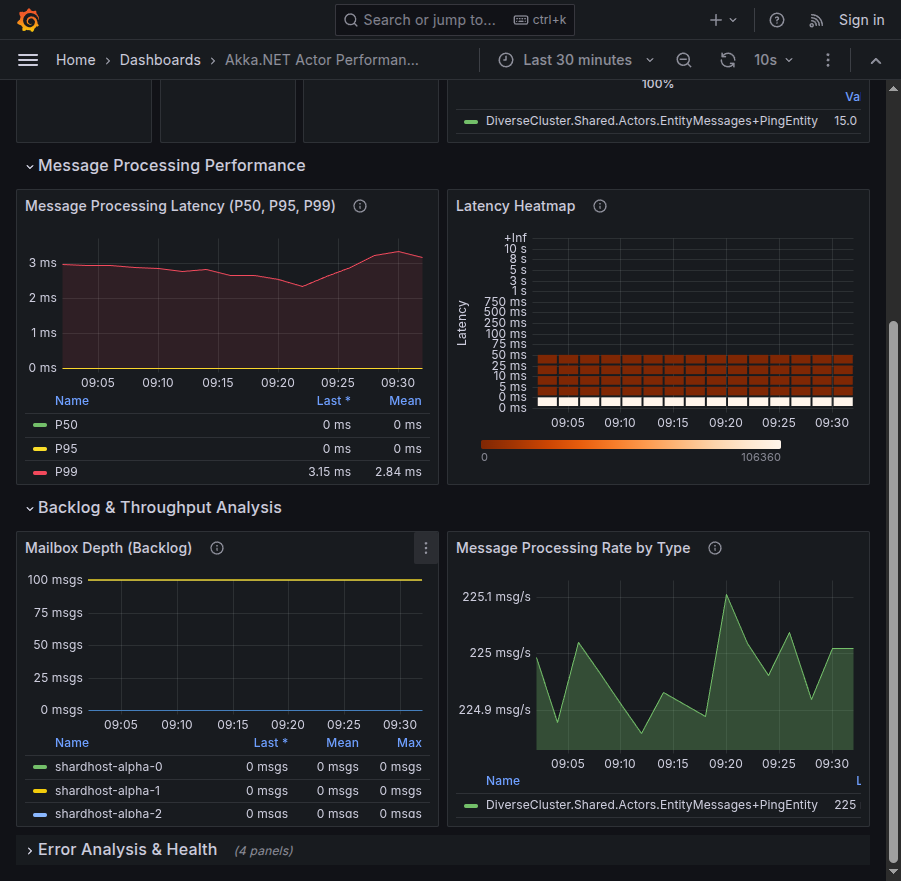

# Phobos Dashboards 📊

Production-ready [Grafana dashboards](https://grafana.com/) for monitoring [Akka.NET](https://getakka.net/) applications instrumented with [Phobos](https://phobos.petabridge.com/) - the observability engine for Akka.NET.

## Overview 🎯

These dashboards provide comprehensive monitoring capabilities for Akka.NET applications using Phobos's OpenTelemetry metrics export. Monitor cluster health, actor performance, message processing latencies, and system resource utilization in real-time.

## Prerequisites ✅

- Grafana 8.0+
- Prometheus data source configured
- Akka.NET application instrumented with [Phobos 2.x](https://phobos.petabridge.com/articles/setup/index.html)
- OpenTelemetry metrics exporter configured

## Available Dashboards 📈

### Cluster Overview Dashboard 🌐

Monitor your entire Akka.NET cluster's health and performance metrics at a glance.

#### Cluster Status and Node Health

*Real-time cluster membership tracking with node status, message rates, and instance details*

#### Logging, Errors, and Actor Metrics

*Monitor logging activity, exception tracking, and actor message processing performance*

#### Sharding Statistics and Message Flow

*Detailed sharding distribution across nodes with message type breakdowns and throughput analysis*

**Key Features:**
- Real-time cluster membership status with Up/Down/Joining/Leaving states
- Node health and availability monitoring with per-instance metrics
- Message throughput and processing rates by message type
- Actor system metrics across all nodes including mailbox backlogs
- Exception tracking with detailed type breakdown
- Sharding statistics for distributed actors
- System resource utilization (CPU, memory, threads)

**Use Cases:**
- Production cluster monitoring and health checks
- Capacity planning and scaling decisions
- Incident detection and response
- Performance baseline establishment
- Sharding distribution analysis

### Actor Performance Dashboard ⚡

Deep-dive into individual actor performance metrics and message processing patterns.

#### Actor Overview and Key Metrics

*Real-time actor counts, message volumes, throughput rates, and latency heatmaps*

#### Detailed Performance Analysis

*Message processing latencies, mailbox depths, and per-instance throughput metrics*

**Key Features:**
- Live actor count monitoring across the cluster
- Message processing latency percentiles (P50, P95, P99)
- Latency heatmap visualization for pattern detection
- Per-actor mailbox depth tracking (backlog monitoring)
- Message type distribution and breakdown
- Individual actor throughput metrics by type
- Per-instance performance comparison
- Actor lifecycle events (starts, stops, restarts)

**Use Cases:**
- Performance bottleneck identification
- Actor optimization and tuning
- Message flow analysis and patterns
- Debugging actor-specific issues
- Capacity planning for actor systems
- Latency spike investigation

## Installation 🚀

### Import via Grafana UI

1. Open Grafana and navigate to **Dashboards** → **Import**
2. Upload the JSON file for the dashboard you want to import:
   - `dashboards/cluster-overview.json` - Cluster Overview Dashboard
   - `dashboards/actor-performance.json` - Actor Performance Dashboard
3. Select your Prometheus data source
4. Click **Import**

### Import via Grafana API

```bash
# Import Cluster Overview Dashboard
curl -X POST http://localhost:3000/api/dashboards/db \
  -H "Content-Type: application/json" \
  -H "Authorization: Bearer YOUR_API_KEY" \
  -d @dashboards/cluster-overview.json

# Import Actor Performance Dashboard
curl -X POST http://localhost:3000/api/dashboards/db \
  -H "Content-Type: application/json" \
  -H "Authorization: Bearer YOUR_API_KEY" \
  -d @dashboards/actor-performance.json
```

## Configuration ⚙️

### Phobos Setup

Ensure your Akka.NET application is properly configured with Phobos. Follow the [official Phobos setup guide](https://phobos.petabridge.com/articles/setup/index.html) for detailed instructions.

Basic configuration example:

```hocon
phobos {
  monitoring {
    monitor-mailbox-depth = on
    monitor-actor-lifecycle = on
    monitor-messages = on
  }
  
  tracing {
    provider-type = "OpenTelemetry"
  }
}
```

### OpenTelemetry Metrics Export

Configure OpenTelemetry to export metrics to Prometheus:

```csharp
using var meterProvider = Sdk.CreateMeterProviderBuilder()
    .AddPhobosInstrumentation()
    .AddPrometheusExporter()
    .Build();
```

### Dashboard Variables

Both dashboards support the following template variables:

- **`$cluster`** - Filter by Akka.NET cluster name
- **`$node`** - Filter by specific node/host
- **`$actor_system`** - Filter by actor system name
- **`$actor_path`** - Filter by actor path (Actor Performance dashboard)

## Metrics Reference 📊

### Key Metrics Monitored

- **`akka_messages_received_total`** - Total messages received by actors
- **`akka_messages_processed_duration`** - Message processing latency histograms
- **`akka_actor_restarts_total`** - Actor restart counts
- **`akka_cluster_members`** - Current cluster membership
- **`akka_mailbox_size`** - Actor mailbox queue depths
- **`akka_deadletters_total`** - Dead letter counts
- **`akka_system_cpu_usage`** - CPU utilization
- **`akka_system_memory_used`** - Memory consumption

For a complete list of available metrics, see the [Phobos Metrics Documentation](https://phobos.petabridge.com/articles/metrics/index.html).

## Troubleshooting 🔧

### Common Issues

**Dashboard shows "No Data":**
- Verify Prometheus is receiving metrics from your application
- Check the data source configuration in Grafana
- Ensure time range selection includes data points
- Validate metric names match your Phobos version

**Missing Panels or Metrics:**
- Confirm Phobos monitoring features are enabled
- Check OpenTelemetry exporter configuration
- Verify Prometheus scrape configuration
- Review application logs for metric export errors

## Support 💬

- [Phobos Documentation](https://phobos.petabridge.com/)
- [Petabridge Support](https://petabridge.com/support/)
- [Akka.NET Discord](https://discord.gg/GSCfPwhbWP)
- [GitHub Issues](https://github.com/petabridge/phobos-dashboards/issues)

## License 📄

Copyright © 2015-2024 [Petabridge, LLC](https://petabridge.com/)

These dashboards are provided as part of the Phobos product suite. See [Phobos licensing](https://phobos.petabridge.com/articles/licensing.html) for details.

## Contributing 🤝

We welcome contributions! Please see our [Contributing Guidelines](CONTRIBUTING.md) for details.

---

Built with ❤️ by [Petabridge](https://petabridge.com/) - Your Akka.NET Success Partner