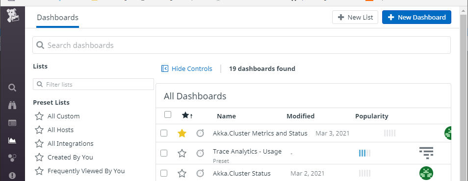
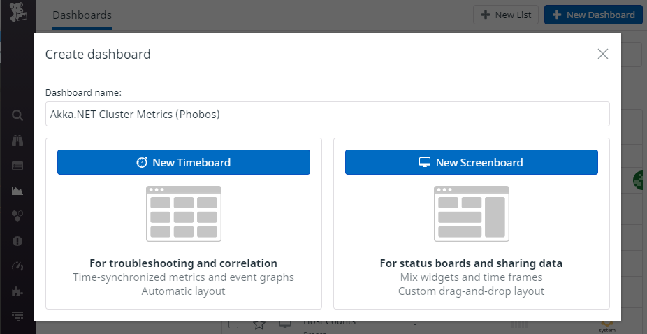
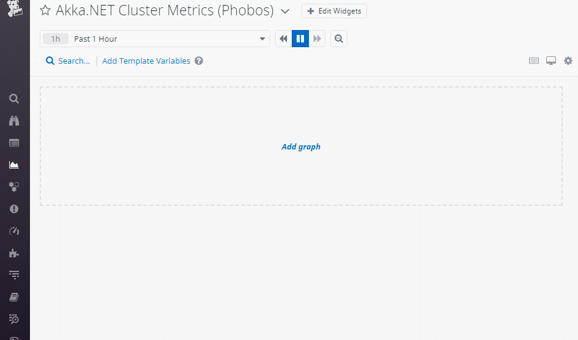
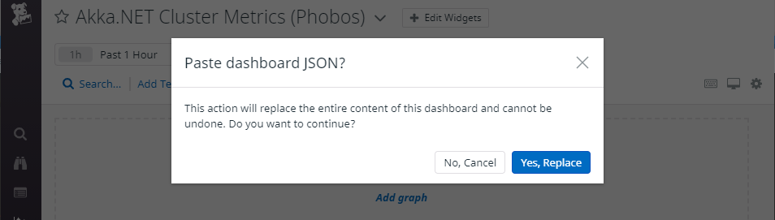
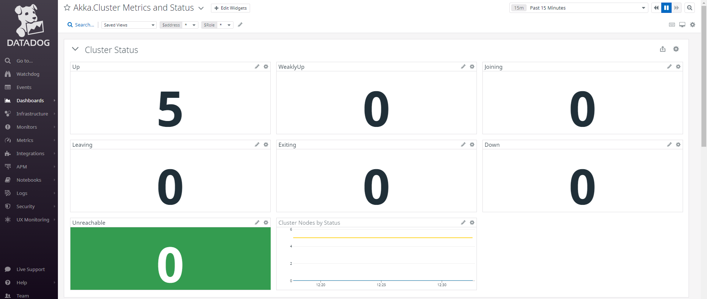

# Akka.NET + Phobos Dashboard for DataDog
This dashboard is intended to be used in combination with [Phobos](https://phobos.petabridge.com/) and optionally, the [Phobos + DataDog tutorial](https://phobos.petabridge.com/articles/tutorials/end-to-end/datadog.html).

## Installation Steps
To install this dashboard into your DataDog account go to your [DataDog Dashboard List](https://app.datadoghq.com/dashboard/lists) and click on **New Dashboard**.

Next, create a **New Timeboard** and give it a name - we used "Akka.NET Cluster Metrics (Phobos)" here.

Click on the gear icon and select **Import Dashboard JSON**.

Import the [`phobos-akka.net-cluster-metrics-datadog.json`](phobos-akka.net-cluster-metrics-datadog.json) file from this repository into the dialog and then click on **Yes, Replace**.

And after that's imported, all of the data reported by Phobos should give you a dashboard that looks very similar to this one!

